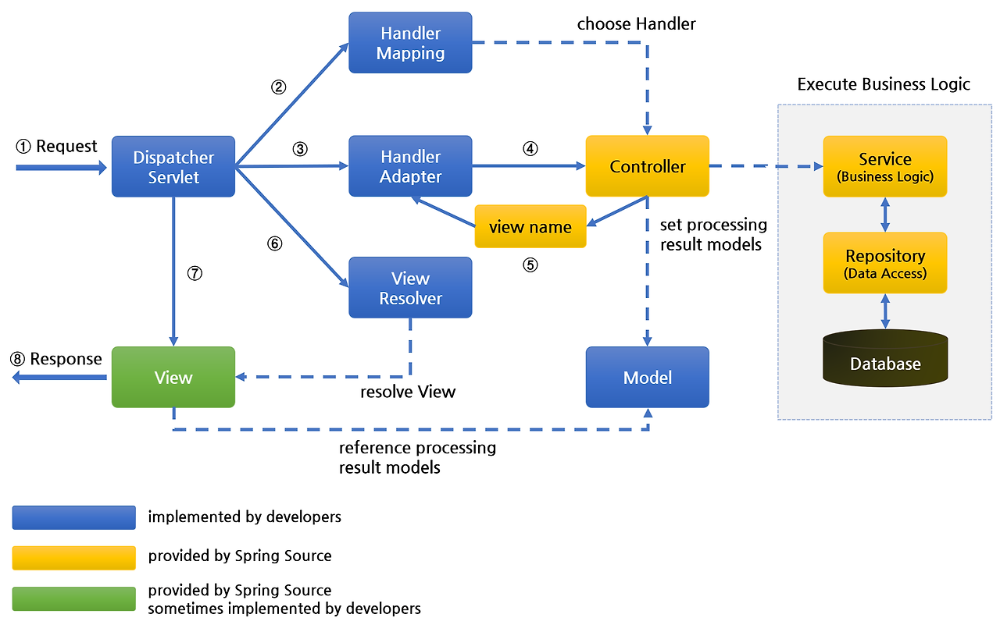

# Part 3-1 Front-End

* [브라우저의 동작 원리](#Spring Framework)

[뒤로](https://github.com/DasolKang/Interview_Question_for_Beginner)

## Spring Framework

동적 웹 사이트 개발을 위한 자바 플랫폼의 오픈 소스 애플리케이션 프레임워크

#### 동작 과정

1. Client 요청을 진입점 역할을 하는 프론트 컨트롤러인 DispatcherServlet이 받는다.
2. DispatcherServlet이 호출한 HandlerMapping은 요청 정보(URL)를 분석하여 적합한 Controller를 선택한다.
3. HandlerAdapter는 요청한 URL에 적합한 Controller를 찾는다.
4. HandlerAdapter는 Controller로 요청을 위임한다. Controller는 Business Logic을 처리한다.
5. View에 전달할 결과를 Model 객체에 저장하여 View Name을 반환한다.
6. DispatcherServlet이 ViewResolver를 호출하여 Controller가 리턴한 view name을 기반으로 적합한 View를 찾아 처리 결과를 전달한다.
7. View 객체는 해당하는 View를 호출한다. View는 Model 객체에 화면을 표시하는 데 필요한 객체를 가져와 화면에 처리하고, Client에 넘겨준다.

#### 특징
1. IoC (Inversion Of Control)
     - 제어의 역전이라는 의미로, 객체의 생성과 의존성 관리를 개발자가 아닌 프레임워크가 담당
     - 결합도 감소: 객체 간의 의존성을 최소화하여, 유지보수성과 확장성을 높입니다.
     - 유연한 구조: 객체 간의 관계를 코드가 아닌 설정 파일이나 어노테이션을 통해 관리함으로써 애플리케이션 구조가 더 유연해집니다.
     - Spring은 IoC 컨테이너를 제공하여, Bean의 생성, 주입, 소멸을 관리합니다.
       (Bean: Spring에서 관리되는 객체를 뜻하며, 컨테이너에 의해 관리되는 자바 객체)

2. DI (Dependency Injection)
   - DI는 객체 간의 의존성을 외부에서 주입하는 설계 패턴
   - 객체는 직접 다른 객체를 생성하지 않고, 필요한 의존성을 외부에서 받아 사용합니다. Spring에서는 IoC 컨테이너가 필요한 의존성을 주입
   - 유연성: 객체의 의존성을 외부에서 주입받으므로, 객체 간의 결합도가 낮아져 유연성이 증가합니다.
   - 테스트 용이성: 객체를 테스트할 때 실제 객체 대신 Mock 객체를 주입해 테스트할 수 있어, 단위 테스트 작성이 용이합니다.
   - 유지보수성: 코드 변경 없이 설정을 통해 의존성 변경이 가능하므로, 유지보수성이 뛰어납니다.

3. AOP (Aspect-Oriented Programming)
   - 관심사를 모듈화하여 핵심 비즈니스 로직과 분리하는 프로그래밍 패러다임
   - 로깅, 보안, 트랜잭션 관리와 같은 기능은 여러 모듈에서 공통적으로 필요하므로 분리하여 코드의 중복을 줄이고 유지보수를 쉽게 만듦
   
 

 

