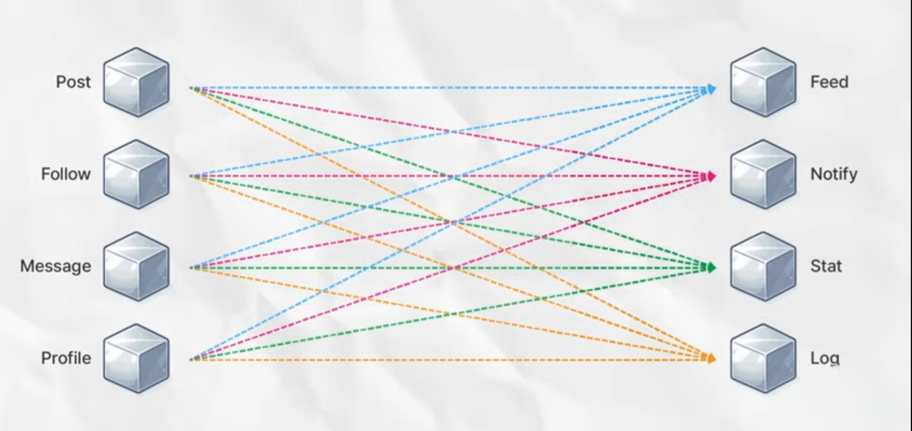
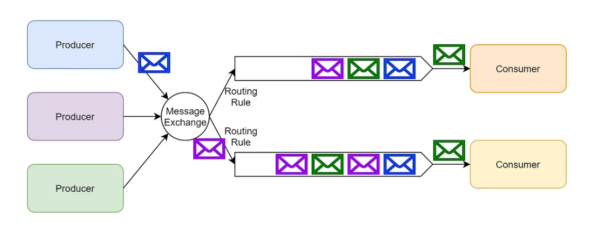
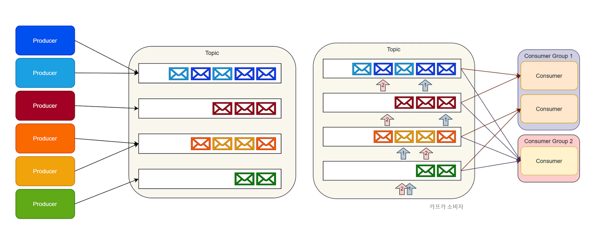

# Project 진행 관련 CS

- [Project 진행 관련 CS](#project-진행-관련-cs)
  - [Message Broker](#message-broker)
    - [Message Broker란 무엇인가?](#message-broker란-무엇인가)
    - [Message Broker의 장점](#message-broker의-장점)
    - [Rabbit MQ](#rabbit-mq)
    - [Kafka (Event Broker)](#kafka-event-broker)

 

## Message Broker

### Message Broker란 무엇인가?

  - 분산 시스템에서 서로 다른 시스템 컴포넌트나 애플리케이션 간에 메시지를 효율적으로 전달하고 관리하는 소프트웨어
  - 메시지 브로커는 메시지를 일시적으로 저장하고 비동기적으로 처리하며, 시스템의 처리 능력에 맞춰 메시지를 관리  
  - 시스템의 부하를 분산시키고, 피크 타임에 발생할 수 있는 부하를 관리하는 데에 중요한 역할

### Message Broker의 장점
  - 확장성   
    대량의 메시지를 처리할 수 있으며, 추가적인 부하를 처리하기 위해 수평적으로 확장 가능
  - 신뢰성  
    메시지는 처리될 때까지 큐에 저장되므로 메시지 큐는 네트워크나 하드웨어 오류와 같은 시스템의 일시적인 오류를 허용
  - 비동기 통신  
    구성 요소 간에 비동기적으로 통신할 수 있으며, 송신자와 수신자를 분리하고 독립적으로 작업 가능
  - 중복성  
    많은 메시지 큐 구현은 노드에 장애가 발생해도 메시지가 손실되지 않도록 메시지 복제와 같은 중복성 기능을 제공

### Rabbit MQ 
- Smart Broker, Dumb Consumer

- 프로듀서가 보낸 순서대로 메모리에 큐 형태로 저장 후 컨슈머가 요청한대로 큐에서 빼내어 전송
- 브로커는 프로듀서로부터 메시지를 받아와 저장 / 받아갈 때마다 제거하는 역할만을 담당
- 메시지들은 주로 메모리에 저장되어 처리가 빠르지만 유실 위험 있다.
- 다양한 프로토콜을 지원하며 주로 AMQP 프로토콜을 사용한다.
- 컨슈머가 받아간 메시지가 삭제되는 것까지 다른 노드들에 실시간 적용되어야 하므로 클러스터링이 까다롭다.
- 시간이 걸리는 작업은 워커들이 분산 처리하는 작업큐를 지원
  - 컨슈머의 위치에 있는 워커들이 작업 하나씩 가져간 후 완료되면 브로커에 신호 전송하여 메시지를 제거
  - 여러 이미지 파일을 업로드 받아 그래픽 처리해주는 서비스에 유용
- 메시지를 특정 큐 / 모든 큐로 보내기 위한 다양한 방식 제공하며 복잡한 메시지 라우팅이 필요한 서비스에 유리
- 컨슈머가 메시지를 성공적으로 처리했는지 여부를 브로커에게 전달하여 신뢰성 있는 전달 보장 
  - 브로커가 메시지 처리여부를 확인할 수 있기 때문에 트랜잭션과 같이 안정적인 처리가 필요한 작업에 적합

### Kafka (Event Broker)
- Dumb Broker, Smart Consumer

- 프로듀서가 보낸 메시지를 디스크에 로그 형태로 저장
  - 로그 안의 메시지들은 인덱스와 같이 각자 오프셋을 갖는다.
- 컨슈머들은 각자 자신이 받아간 마지막 오프셋을 기억하여 중복없이 다음 데이터 받아간다.
  - 메시지는 컨슈머가 받아간 후에도 지워지지 않아 유실로부터 안전하다.
  - 필요에 따라 컨슈머가 특정 메시지를 여러번 받을 수 있다. 
      (장애 발생 시 문제 있는 부분 부터 다시 받을 수 있다.)
  - 컨슈머의 구현이 까다로워질 수 있다.
- TCP 기반의 자체적인 프로토콜을 사용하며 대용량 데이터 처리에 강점을 갖는다.
- 디스크는 메모리보다 속도 느리지만 순차적으로 저장하며 성능 극대화시킨다.
- 기본적으로 Batch 기능을 제공하기 때문에 메시지를 여럿이 받아오거나 보내주는 일도 Rabbit MQ에 비해 빠르고 간편하게 처리된다.
- 브로커를 여러 서버에 분산하여 운영하는 클러스터링에 유리하다.
  - 컨슈머가 오프셋을 사용하여 메시지에 접근하므로 각 노드는 받아온 메시지들만 동기화하면 된다.
- 분산시스템의 높은 처리량을 필요로하는 대용량 실시간 스트리밍, 데이터 파이프라인, 로그 집계 및 분석에 유리하다.

 
    
[뒤로](https://github.com/DasolKang/Interview_Question_for_Beginner) / [위로](#Project-진행-관련-CS) &nbsp; | &nbsp; [참고1](https://betterprogramming.pub/rabbitmq-vs-kafka-1ef22a041793) 
[참고2](https://www.youtube.com/watch?v=0lyrd5FlETQ)  

 

